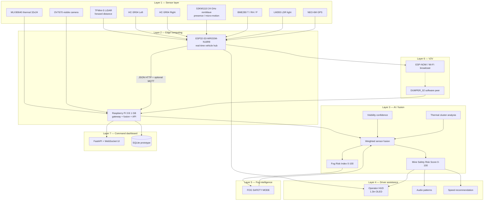
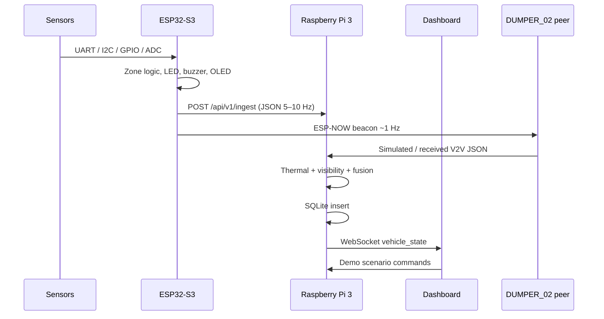

# System architecture — MineVision Guardian

Problem statement **26007**. Prototype name: **MineVision Guardian – Intelligent Fog Navigation and Collision Prevention System**.

The architecture is a **seven-layer multi-sensor fusion stack**. No single sensor is trusted in every weather condition. The operator remains in control; the stack recommends speed and raises alerts.

## 1. Layered architecture



## 2. Hardware responsibility allocation

| Function | ESP32-S3 | Raspberry Pi 3 |
|---|---|---|
| TFMini-S, ultrasonics, BME280, LDR, GPS, mmWave | **Owner** | Consumes JSON |
| Immediate danger LED / buzzer / OLED / local STOP flag | **Owner** (sub-10 ms class) | Mirrors on HUD |
| MLX90640 full thermal matrix | Optional summary only | **Owner** |
| OV7670 / USB camera + visibility metrics | Not connected (pin budget) | **Owner** |
| Sensor fusion, Fog Index, Risk Score | Zone logic only | **Owner** |
| SQLite logs, REST, WebSocket dashboard | HTTP client | **Owner** |
| ESP-NOW V2V broadcast | **Owner** | Ingests peer packets |
| Heavy neural nets (YOLO-class) | No | **No** — Pi 3 1 GB cannot do this |

**Why the camera is on the Pi, not the ESP32-S3:** OV7670 needs D0–D7 + PCLK/VSYNC/HREF/XCLK/SCCB — more GPIOs than remain after three UARTs, I2C, two ultrasonics, ADC, and alert I/O. The Pi also needs the frames for contrast / blur / edge-density visibility scoring.

**Why thermal is on the Pi:** 32×24 float frames and cluster segmentation fit Python; the ESP32 still receives a compact `thermal_anomaly` / `max_temp_c` summary if the Pi is down, via a future I2C share. For this prototype MLX90640 is wired to Pi I2C1.

## 3. Real-time vs. deliberative split

ESP32-S3 **hard safety** (must work even if the Pi or Wi-Fi dies):

```
IF LiDAR < 1.5 m OR left US < 1.0 m OR right US < 1.0 m:
    buzzer CONTINUOUS
    OLED: STOP VEHICLE
Above those ranges the dashboard must not show DANGER on that channel.
```

Pi **soft safety** (fusion, fog mode, command-room view). Loss of Pi must never silence the ESP32 buzzer.

## 4. Configurable safety zones (prototype scale)

Defaults match the PDF; they are **not** mine-legal braking distances. A real 100-tonne dumper at haul speed needs tens of metres of industrial LiDAR, not 12 m.

| Zone | Default | Meaning |
|---|---|---|
| SAFE | `front > 8.0 m` | Green / NORMAL SPEED |
| WARNING | above DANGER, up to 8.0 m | Yellow HUD |
| DANGER LiDAR | `front < 1.5 m` | Red + cab buzzer |
| DANGER US | `left or right < 1.0 m` | Red + cab buzzer |

## 5. Data flow



## 6. Network

| Link | Prototype | Production upgrade |
|---|---|---|
| ESP32 → Pi | HTTP REST 5–10 Hz on private Wi-Fi AP | MQTT over private 5G / Wi-Fi 6 mesh |
| Dashboard | WebSocket on Pi `:8000` | Redundant control-room servers |
| V2V | ESP-NOW + software second vehicle | Industrial V2X / C-V2X / LoRaWAN heartbeat |

Pi can create a Wi-Fi AP (`minevision`) or join an existing router. ESP32 uses `firmware/include/secrets.h`.

## 7. Software building blocks

| Block | Implementation |
|---|---|
| Vehicle hub | Arduino / PlatformIO C++ on ESP32-S3 |
| Fusion + API | Python 3.11 FastAPI on Pi (also runs on Windows in sim) |
| Database | SQLite (`data/minevision.db`) |
| UI | Static HTML/CSS/JS, Leaflet, Chart.js |
| Tests | `raspberry_pi/tests/` pytest for every scoring formula |

## 8. Bailadila operational context (simulation defaults)

- Nominal map centre: **18.720° N, 81.230° E** (Kirandul / Bacheli haul-road corridor, approximate).
- Fog season: monsoon, high RH, low illumination in pits.
- Prototype vehicle IDs: `DUMPER_01` (hardware or sim), `DUMPER_02` (V2V peer).

GPS on NEO-6M is for **fleet awareness on a map**, not for closing a collision loop. Closing that loop in production requires RTK GNSS + vehicle IMU + industrial ranging.
