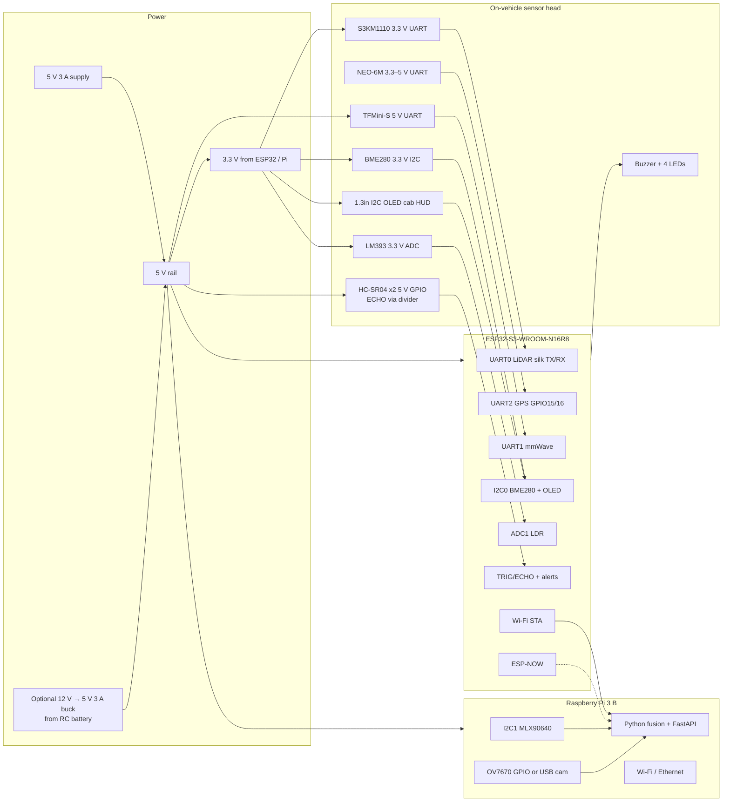

# Hardware block diagram

## Physical mounting (miniature dumper / RC)

| Sensor | Mount | Notes |
|---|---|---|
| TFMini-S | Front bumper, slightly above chassis, lens clear of bumper lip | Do not look into sun; keep glass dry |
| HC-SR04 left / right | Side skirts, 10–20 cm above ground | Soft targets absorb 40 kHz poorly |
| mmWave | Front or cabin-equivalent, facing expected pedestrian path | 24 GHz sees through light cloth, not thick metal |
| MLX90640 | Forward-facing, 55° FOV centred on haul path | Keep 10 cm from ESP32 Wi-Fi antenna |
| OV7670 / USB cam | Forward, parallel to LiDAR | Fog demo: compare RGB vs thermal |
| BME280 | Shaded, not on motor heat | Rain splash will ruin it — under a hood |
| LDR | Upward / sky-facing, not in LED glare | |
| GPS | Top of cab mock-up, sky view | Indoor fix will be invalid |
| 1.3" OLED | Cab mock-up, operator eye line | I2C with BME280 on pads 8/9 |
| ESP32 | Inside cab mock-up | USB-C debug accessible |
| Pi 3 | Rear / offboard table for demo if vibration is high | HDMI optional; judges use laptop browser |

## Communication protocols

| Device | Protocol | Rate | Address / baud |
|---|---|---|---|
| TFMini-S | UART 8N1 | 100 Hz default | 115200, header `0x59 0x59` |
| NEO-6M | UART NMEA | 1 Hz | 9600 |
| S3KM1110 | UART 8N1 | ~10 Hz reports | 115200, report header `F4 F3 F2 F1` |
| BME280 | I2C | 2 Hz | `0x76` (or `0x77`) |
| MLX90640 | I2C | 2 Hz prototype | `0x33` |
| OV7670 | SCCB + DVP | low | SCCB `0x21` |
| LDR | Analog | 10 Hz | ADC 12-bit |
| HC-SR04 | GPIO pulse | 10 Hz each, staggered | TRIG 10 µs |
| 1.3" OLED | I2C SH1106 128×64 | on zone change | SDA 8, SCL 9, addr 0x3C |
| ESP32 → Pi | HTTP JSON | 5 Hz | `POST /api/v1/ingest` |
| V2V | ESP-NOW | 1 Hz | 250-byte payload |
