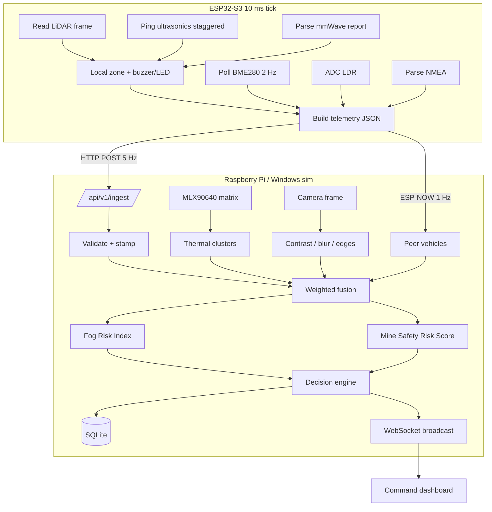

# Data flow diagram

## JSON cadence

| Message | Hz | Path |
|---|---|---|
| ESP32 telemetry | 5 | `POST /api/v1/ingest` |
| Thermal snapshot | 2 | internal, then folded into state |
| Visibility metrics | 1 | internal |
| Fused `vehicle_state` | 5 | WebSocket `/ws/fleet` |
| V2V beacon | 1 | ESP-NOW / sim |
| Alert events | on edge | REST + WS `alert` |

## Backpressure

If Wi-Fi drops, ESP32 keeps a ring buffer of the last 20 danger events and retries. The Pi marks `link: degraded` after 2 s without ingest and raises CAUTION (not CRITICAL) for comms loss — comms loss is not an obstacle.
